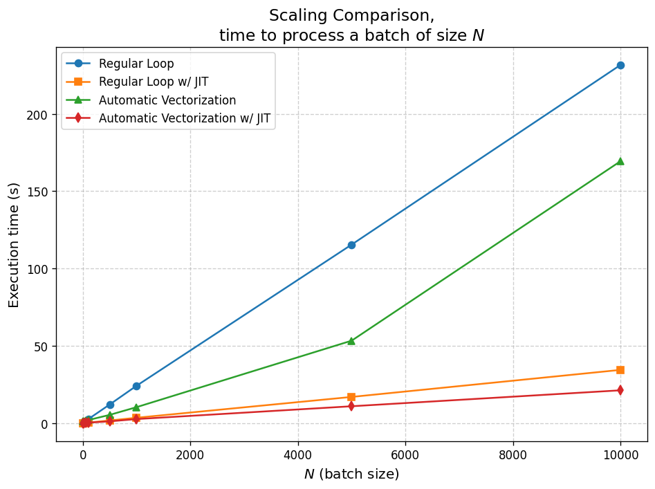
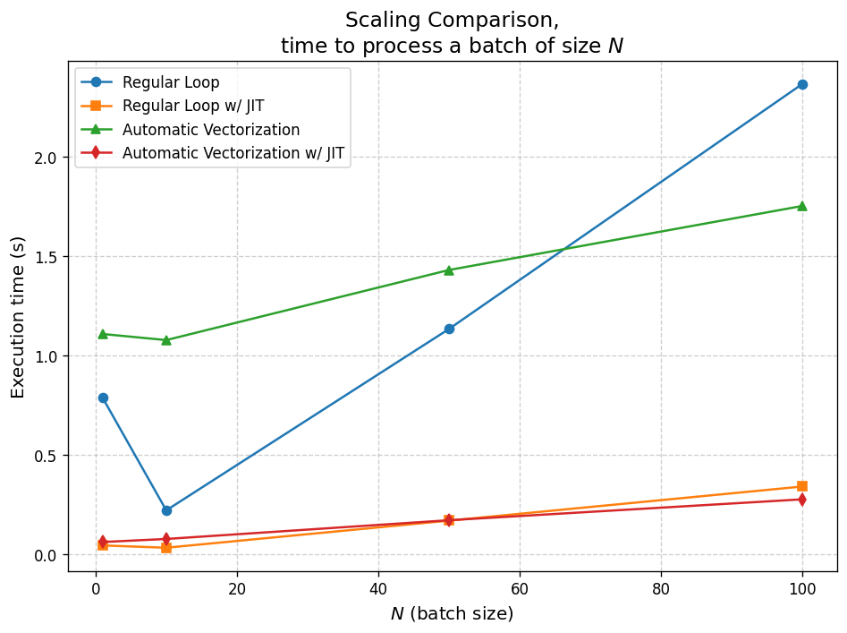
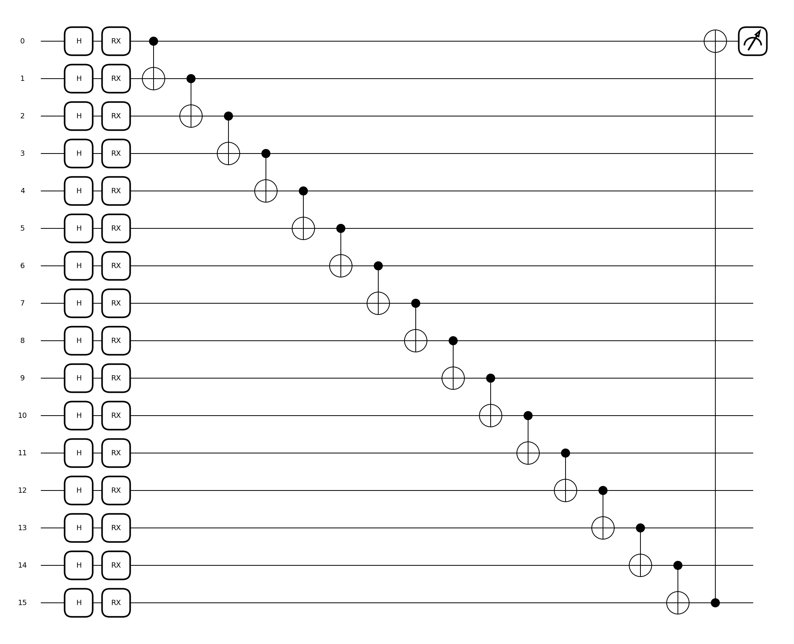

# Jax-QML
 
This repo aims to introduce JAX to researchers and practitioners in Quantum Machine Learning (QML) who may not yet be familiar with it. We will cover the fundamentals of JAX and showcase why its particularly well suited for working with quantum circuits in the context of QML with PennyLane. However, this is not an in-depth technical deep dive. For a more comprehensive exploration, we recommend referring to the official [JAX](https://jax.readthedocs.io/en/latest/quickstart.html) and [PennyLane](https://docs.pennylane.ai/en/stable/index.html) docs, which provide excellent resources.

> [Notebook version](https://github.com/uriballo/Jax-QML/blob/main/JAX-QML-Intro.ipynb)
> 
> [PDF version](https://github.com/uriballo/Jax-QML/blob/main/JAX-QML-Intro.pdf)

TL;DR:

zooming at low batch sizes:

for this given quantum circuit:
